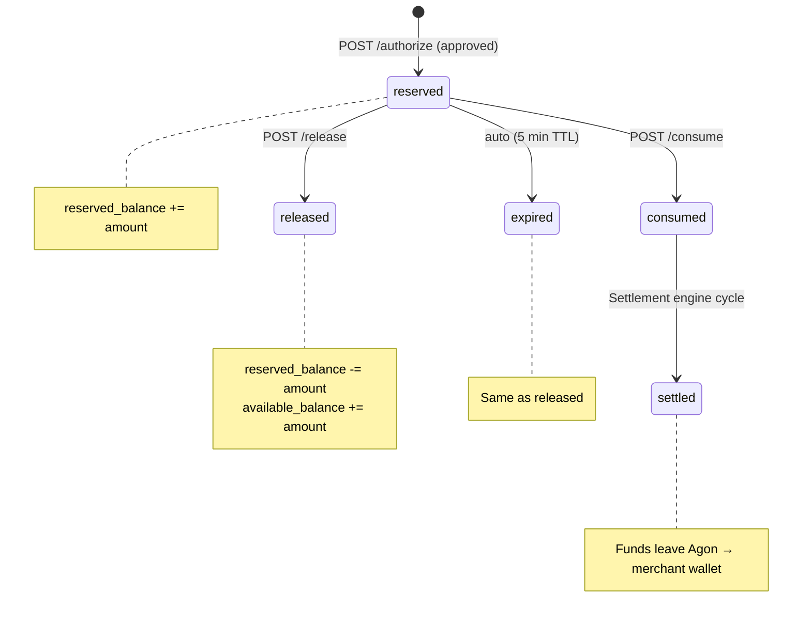

## State Summary

| State | `available_balance` | `reserved_balance` | Notes |
|---|---|---|---|
| `reserved` | -amount | +amount | Funds held, API call in-flight |
| `consumed` | unchanged | unchanged | Awaiting settlement cycle |
| `released` | +amount | -amount | Call failed — funds returned |
| `expired` | +amount | -amount | Auto-release after 5 min |
| `settled` | unchanged | -amount | Funds transferred to merchant on-chain |
