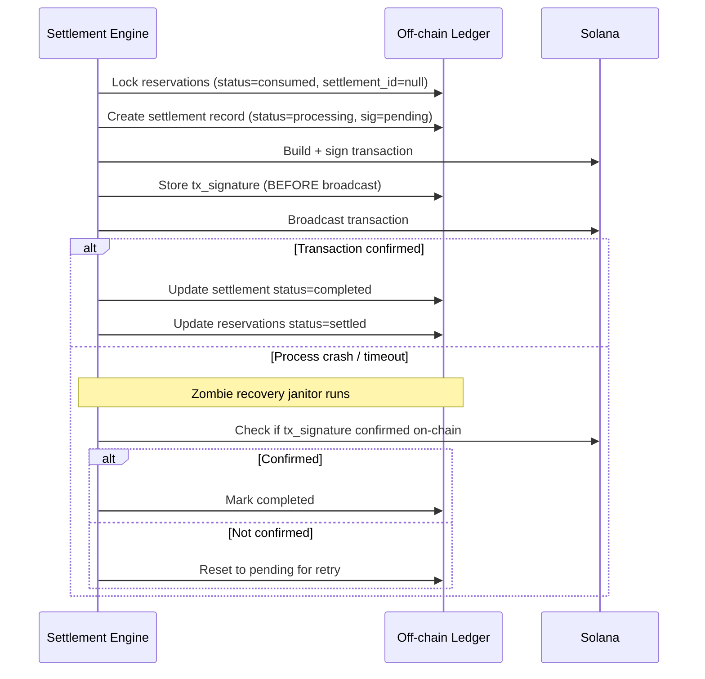

The settlement engine is why Agon's on-chain footprint stays constant as volume grows.

## How Netting Works

All consumed payments to a merchant are aggregated into one number per settlement:

```sql
SELECT platform_id, SUM(amount) AS total_owed
FROM reservations
WHERE status = 'consumed'
  AND settlement_id IS NULL
GROUP BY platform_id
ORDER BY total_owed DESC;
```

## Consolidation

All merchant payouts for a given settlement are packed into a single Solana transaction:

| Transaction Type | Merchants Per Tx |
|---|---|
| Legacy transaction | Up to 20 |
| Versioned + Address Lookup Tables | Up to ~55 |

## Settlement Economics

| Scenario | Direct x402 | Agon |
|---|---|---|
| 100 calls → 1 merchant | 100 transactions | 1 settlement tx |
| 1M calls → 50 merchants | 1,000,000 transactions | 3 transactions |
| 1B calls → 50 merchants | 1,000,000,000 transactions | **still 3 transactions** |

<Tip>
  Transaction count is **O(merchants)**, not **O(calls)**. The efficiency advantage scales directly with usage volume.
</Tip>

## Triggering Settlement

Merchants trigger settlement manually via `POST /platform/settle` or the Agon dashboard. Automatic scheduled settlement is not yet implemented.

## Resilience


