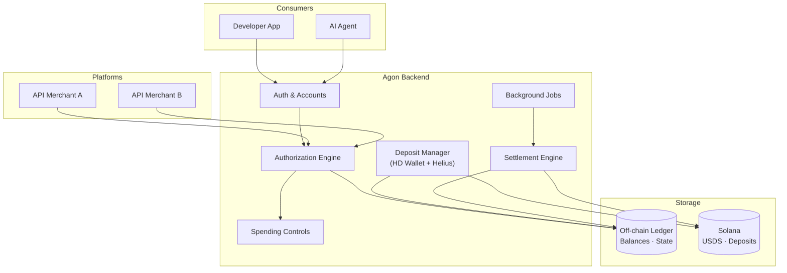

Agon is composed of six primary subsystems, each with a distinct responsibility.

## Tech Stack

| Layer | Technology |
|---|---|
| API Server | Fastify + TypeScript |
| Ledger | PostgreSQL (with pg transactions for atomicity) |
| Blockchain | Solana — USDC SPL token |
| Deposit Detection | Helius enhanced webhooks |
| Web Auth | Privy (embedded wallets + social login) |
| Agent Auth | Ed25519 signature verification (nacl) |
| HD Wallet | BIP-39 mnemonic + BIP-32 derivation |
| Frontend | Next.js 14 (App Router) |

## Subsystem Responsibilities

<Columns>
  <Column>
    **Authorization Engine**

    Handles `POST /authorize`, `POST /consume`, `POST /release`. The critical-path subsystem — all operations are atomic ledger transactions. No blockchain calls on the hot path.

    **Deposit Manager**

    Monitors Helius webhooks for USDC transfers to HD-derived deposit addresses. Credits consumer balances automatically. A sweep job runs periodically as a fallback.
  </Column>
  <Column>
    **Settlement Engine**

    Triggered by the merchant via API or dashboard. Aggregates all consumed reservations per merchant, nets totals, and packs all payouts into a single Solana transaction with double-send protection.

    **Background Jobs**

    Periodic tasks: resolve expired reservations, reconcile off-chain ledger vs on-chain USDC balances, evaluate auto-refill triggers, recover zombie settlements.
  </Column>
</Columns>
