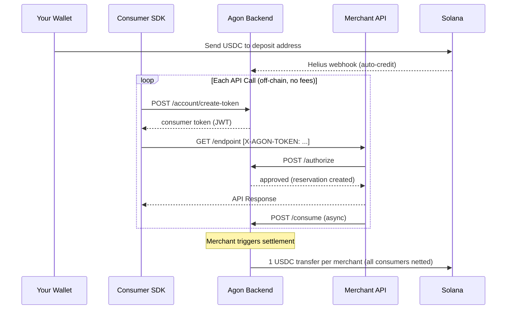

From deposit to settlement in four steps.

<Info>
  Examples use `https://api-devnet.agonx402.com` (devnet). For production, replace with `https://api-mainnet.agonx402.com`. See [Environments](/api-reference/introduction#environments).
</Info>

<Steps>
  <Step title="Create an Account & Deposit">
    Register to receive a unique HD-derived Solana address. Send USDC there from any wallet. Agon detects the transfer via Helius webhooks and credits your balance automatically — typically within seconds.

    ```typescript
    import { AgonClient } from '@agonx402/client'

    const agon = new AgonClient({
      baseUrl: 'https://api-devnet.agonx402.com',
      apiKey: process.env.AGON_API_KEY!,
      signer: async (msg) => myWallet.sign(msg),
    })

    const account = await agon.getAccount()
    console.log('Send USDC to:', account.depositAddress)
    // Your balance appears automatically — no further action needed
    ```

    <Note>
      A periodic sweep job also runs as a failsafe, ensuring no deposit is ever missed even if a webhook is delayed.
    </Note>
  </Step>

  <Step title="Call a Paid API">
    Use `agon.fetch()` as a drop-in replacement for `fetch()`. The SDK handles the entire payment lifecycle: generating a short-lived consumer token, attaching it to the request, and managing the authorization flow.

    ```typescript
    // Drop-in for fetch() — payment is handled automatically
    const response = await agon.fetch('https://api.example.com/v1/generate')
    const data = await response.json()
    ```

    **Under the hood:**
    1. SDK mints a short-lived, single-use consumer token (`POST /account/create-token`)
    2. Token is attached to the request as `X-AGON-TOKEN`
    3. Merchant's SDK calls Agon `/authorize` — funds reserved off-chain instantly
    4. Merchant processes and responds
    5. Merchant calls Agon `/consume` — reservation finalized. No on-chain transaction occurs
  </Step>

  <Step title="Settlement">
    When the merchant is ready to collect, they trigger settlement via `POST /platform/settle` or the Agon dashboard:

    1. All consumed reservations are grouped by merchant
    2. Every consumer's charges to a given merchant are **netted** into one sum
    3. All payouts are packed into **one Solana transaction**
    4. The transaction broadcasts and the off-chain ledger is reconciled

    The merchant receives a single consolidated USDC transfer — regardless of how many consumers called their API or how many times.
  </Step>

  <Step title="Withdraw Anytime">
    Your `available_balance` is yours. Withdraw to your owner wallet on-chain at any time — no lock-up period, no minimum, no delay.

    ```typescript
    const result = await agon.withdraw(5) // 5 USDC → your wallet immediately
    console.log('On-chain signature:', result.txSignature)
    ```
  </Step>
</Steps>

## Full Flow Diagram


